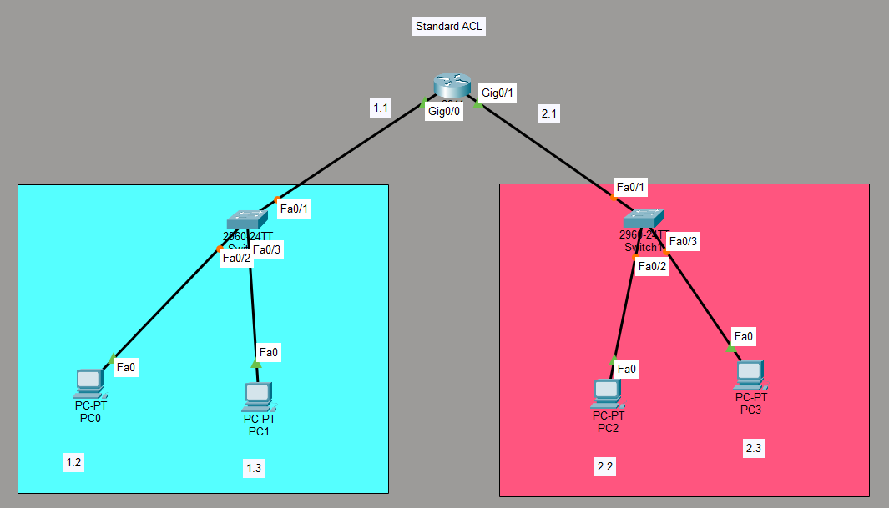
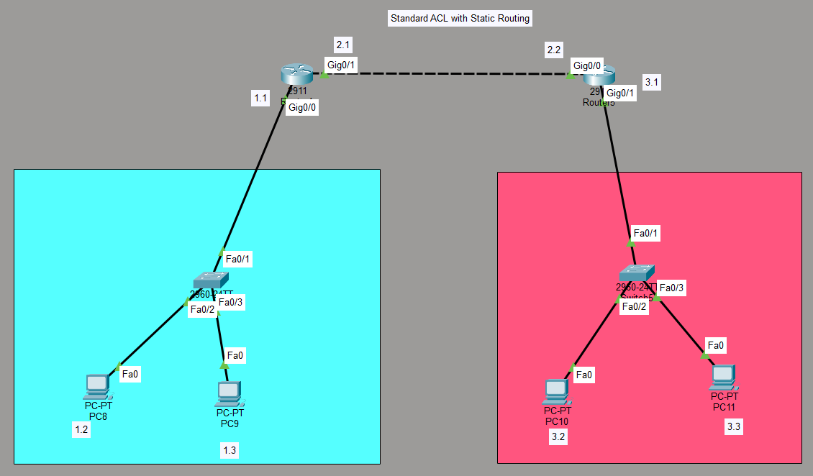
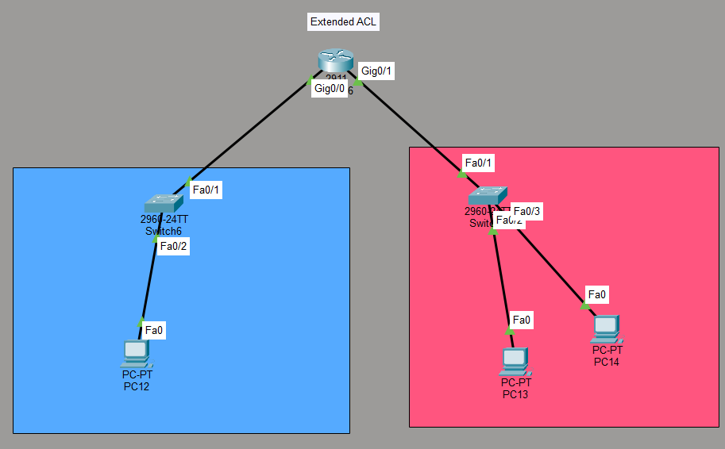

# ACL Lab: Standard and Extended Access Control Lists

## Objective
Configure Standard and Extended ACLs to control network traffic in three different scenarios:
1. **Standard ACL** — Block a specific host from accessing a remote network
2. **Standard ACL with Static Routing** — Block a host across a routed network
3. **Extended ACL** — Block HTTP traffic from a specific host while allowing all other IP traffic

## Topologies

### Scenario 1: Standard ACL (Basic)


**Description:**
- Router `ACL` (2911) with Gig0/0 (192.168.1.1) and Gig0/1 (192.168.2.1)
- Switch 1 (2960) connects PC0 and PC1 on 192.168.1.0/24
- Switch 2 (2960) connects PC2 and PC3 on 192.168.2.0/24
- **Goal:** Block PC0 (192.168.1.2) from reaching the 192.168.2.0/24 network

### Scenario 2: Standard ACL with Static Routing


**Description:**
- Two routers connected via serial link (192.168.2.0/24)
- Left Router: Gig0/0 (192.168.1.1) → Switch → PC8, PC9
- Right Router: Gig0/1 (192.168.3.1) → Switch → PC10, PC11
- Static routes configured on both routers
- **Goal:** Block PC8 (192.168.1.2) from reaching the 192.168.3.0/24 network

### Scenario 3: Extended ACL


**Description:**
- Router (2911) with Gig0/0 (192.168.1.1) and Gig0/1 (192.168.2.1)
- PC12 on 192.168.1.0/24, PC13 and PC14 on 192.168.2.0/24
- Extended ACL 100 applied **inbound** on Gig0/0
- **Goal:** Block HTTP traffic from PC12 (192.168.1.2) to PC13 (192.168.2.2) while allowing all other IP traffic

---

## Devices Used (Total Across All Scenarios)
- **4 Routers** (Cisco 2911)
- **6 Switches** (Cisco 2960)
- **11 PCs**

---

## Scenario 1: Standard ACL — Configuration

### IP Addressing
| Device | IP Address | Subnet |
|--------|------------|--------|
| Router Gig0/0 | 192.168.1.1 | 255.255.255.0 |
| Router Gig0/1 | 192.168.2.1 | 255.255.255.0 |
| PC0 | 192.168.1.2 | 255.255.255.0 |
| PC1 | 192.168.1.3 | 255.255.255.0 |
| PC2 | 192.168.2.2 | 255.255.255.0 |
| PC3 | 192.168.2.3 | 255.255.255.0 |

### Key Concepts
- Standard ACL (numbered 1–99)
- Denying a specific host
- Applying ACL outbound on Gig0/1

### Configuration
```
access-list 1 deny host 192.168.1.2
access-list 1 permit 192.168.1.0 0.0.0.255
!
interface Gig0/1
ip access-group 1 out
```

### Verification
```
- `show access-lists`
- From PC0 (192.168.1.2): `ping 192.168.2.2` → **Fails** (blocked)
- From PC1 (192.168.1.3): `ping 192.168.2.2` → **Succeeds** (allowed)
```
---

## Scenario 2: Standard ACL with Static Routing — Configuration

### IP Addressing
| Device | IP Address | Subnet |
|--------|------------|--------|
| Left Router Gig0/0 | 192.168.1.1 | 255.255.255.0 |
| Left Router Gig0/1 | 192.168.2.1 | 255.255.255.0 |
| Right Router Gig0/0 | 192.168.2.2 | 255.255.255.0 |
| Right Router Gig0/1 | 192.168.3.1 | 255.255.255.0 |
| PC8 | 192.168.1.2 | 255.255.255.0 |
| PC9 | 192.168.1.3 | 255.255.255.0 |
| PC10 | 192.168.3.2 | 255.255.255.0 |
| PC11 | 192.168.3.3 | 255.255.255.0 |

### Key Concepts
- Static routing between routers
- Standard ACL applied across a routed network
- Applying ACL outbound on the right router's Gig0/1

### Configuration

**Left Router:**
```
ip route 192.168.3.0 255.255.255.0 192.168.2.2
```
**Right Router:**
```
ip route 192.168.1.0 255.255.255.0 192.168.2.1
!
access-list 2 deny host 192.168.1.2
access-list 2 permit 192.168.1.0 0.0.0.255
!
interface Gig0/1
ip access-group 2 out
```

### Verification
```
- `show access-lists`
- `show ip route` (confirm static routes)
- From PC8 (192.168.1.2): `ping 192.168.3.2` → **Fails** (blocked)
- From PC9 (192.168.1.3): `ping 192.168.3.2` → **Succeeds** (allowed)
```
---

## Scenario 3: Extended ACL — Configuration

### IP Addressing
| Device | IP Address | Subnet |
|--------|------------|--------|
| Router Gig0/0 | 192.168.1.1 | 255.255.255.0 |
| Router Gig0/1 | 192.168.2.1 | 255.255.255.0 |
| PC12 | 192.168.1.2 | 255.255.255.0 |
| PC13 | 192.168.2.2 | 255.255.255.0 |
| PC14 | 192.168.2.3 | 255.255.255.0 |

### Key Concepts
- Extended ACL (numbered 100–199)
- Blocking TCP port 80 (HTTP)
- Applying ACL **inbound** on the source interface
- `permit ip any any` to allow all other traffic

### Configuration
```
access-list 100 deny tcp host 192.168.1.2 host 192.168.2.2 eq www
access-list 100 permit ip any any
!
interface Gig0/0
ip access-group 100 in
```

### Verification
```
- `show access-lists`
- From PC12 (192.168.1.2): Open web browser to `192.168.2.2` → **Blocked**
- From PC12: `ping 192.168.2.2` → **Succeeds** (ICMP allowed)
- From PC13 (192.168.2.2): `ping 192.168.1.2` → **Succeeds**
```
---

## What I Learned
- **Standard ACLs** filter based on **source IP only** and should be placed **near the destination**.
- **Extended ACLs** filter based on **source, destination, protocol, and port** and should be placed **near the source**.
- ACLs are processed **top-down**; the first match wins.
- The `permit ip any any` at the end of an extended ACL is crucial — without it, all other traffic would be denied.
- Static routing is required for connectivity between remote subnets before ACLs can be applied effectively.
- Standard ACLs can block a single host with `deny host <ip>` and permit the rest of the subnet.

---

## Files Included
| File | Description |
|------|-------------|
| `ACL.pkt` | Packet Tracer file containing all three scenarios |
| `Topology1.png` | Scenario 1 topology screenshot |
| `Topology2.png` | Scenario 2 topology screenshot |
| `Topology3.png` | Scenario 3 topology screenshot |
| `README.md` | This documentation |
