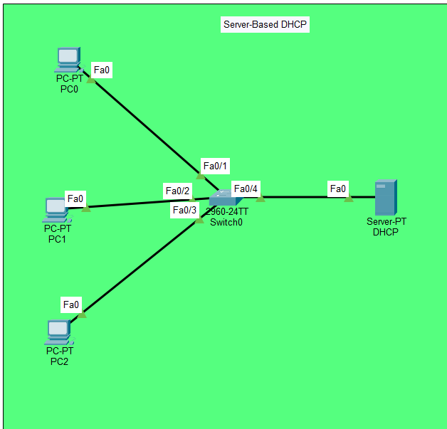
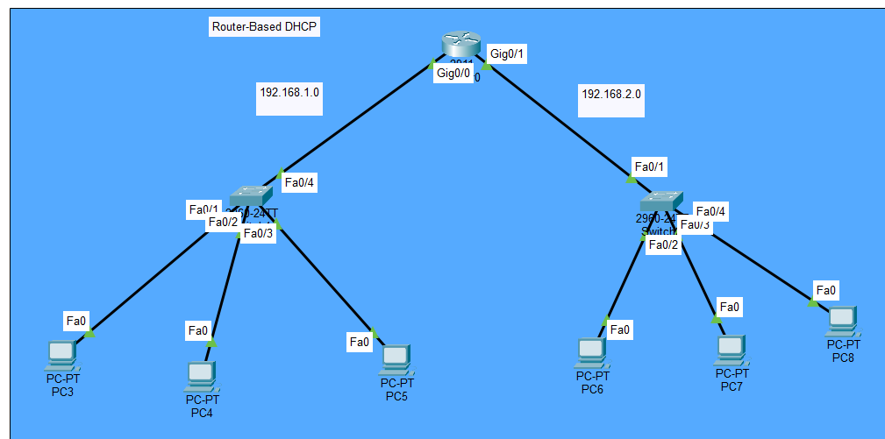

# DHCP Lab: Server-Based and Router-Based DHCP Configuration

## Objective
Configure DHCP services in two different scenarios:
1. **Server-Based DHCP** — A dedicated DHCP server assigns IP addresses to clients
2. **Router-Based DHCP** — A Cisco router acts as the DHCP server for two subnets with exclusions

## Topologies

### Scenario 1: Server-Based DHCP

**Description:**
- 1 Switch (2960-24TT)
- 1 Server (DHCP) connected to Fa0/4
- 3 PCs (PC0, PC1, PC2) connected to Fa0/1, Fa0/2, Fa0/3
- Server provides IP addresses to all PCs on the 192.168.1.0/24 network

### Scenario 2: Router-Based DHCP

**Description:**
- 1 Router (2911) with Gig0/0 (192.168.1.0/24) and Gig0/1 (192.168.2.0/24)
- 2 Switches (2960-24TT)
- 6 PCs (PC3, PC4, PC5 on the 192.168.1.0/24 network; PC6, PC7, PC8 on the 192.168.2.0/24 network)
- Router acts as the DHCP server for both subnets with excluded IP ranges

---

## Devices Used
- **1 Router** (Cisco 2911)
- **1 Server** (DHCP)
- **3 Switches** (Cisco 2960-24TT)
- **9 PCs**

---

## Scenario 1: Server-Based DHCP — Configuration

### IP Addressing
| Device | IP Address | Subnet |
|--------|------------|--------|
| Server DHCP | 192.168.1.2 (Static) | 255.255.255.0 |
| PC0 | 192.168.1.50 (DHCP) | 255.255.255.0 |
| PC1 | 192.168.1.52 (DHCP) | 255.255.255.0 |
| PC2 | 192.168.1.51 (DHCP) | 255.255.255.0 |

### Server DHCP Configuration
| Setting | Value |
|---------|-------|
| Pool Name | serverPool |
| Default Gateway | 192.168.1.2 |
| DNS Server | 8.8.8.8 |
| Start IP Address | 192.168.1.50 |
| Subnet Mask | 255.255.255.0 |
| Maximum Number of Users | 206 |

### Key Concepts
- Dedicated DHCP server for IP assignment
- Automatic IP addressing for clients
- Default gateway and DNS configuration

### Verification
- `ipconfig` on each PC shows an IP in the 192.168.1.50–192.168.1.255 range
- PCs can ping each other and the server

---

## Scenario 2: Router-Based DHCP — Configuration

### IP Addressing
| Device | IP Address | Subnet |
|--------|------------|--------|
| Router Gig0/0 | 192.168.1.1 | 255.255.255.0 |
| Router Gig0/1 | 192.168.2.1 | 255.255.255.0 |
| PC3, PC4, PC5 | 192.168.1.x (DHCP) | 255.255.255.0 |
| PC6, PC7, PC8 | 192.168.2.x (DHCP) | 255.255.255.0 |

### Router Configuration

ip dhcp excluded-address 192.168.1.1 192.168.1.30
ip dhcp excluded-address 192.168.2.1 192.168.2.40
!
ip dhcp pool 1
network 192.168.1.0 255.255.255.0
default-router 192.168.1.1
dns-server 8.8.8.8
!
ip dhcp pool 2
network 192.168.2.0 255.255.255.0
default-router 192.168.2.1
dns-server 8.8.8.8
!
interface GigabitEthernet0/0
ip address 192.168.1.1 255.255.255.0
no shutdown
!
interface GigabitEthernet0/1
ip address 192.168.2.1 255.255.255.0
no shutdown

### Key Concepts
- Router as DHCP server for multiple subnets
- IP address exclusions to reserve addresses for static devices
- Two separate DHCP pools for two subnets
- Default gateway and DNS server per pool

### Verification
- `show ip dhcp pool` — displays pool information
- `show ip dhcp binding` — displays assigned IP addresses
- `ipconfig` on each PC shows an IP in the correct range
- PCs on different subnets can ping each other through the router

---

## What I Learned
- **Server-based DHCP** is ideal for larger networks where a dedicated server can manage IP assignments centrally.
- **Router-based DHCP** is efficient for smaller networks and branch offices where a dedicated server isn't available.
- **IP exclusions** (`ip dhcp excluded-address`) prevent the DHCP server from assigning IPs that are reserved for routers, servers, and other static devices.
- Multiple DHCP pools can be configured on a single router to serve different subnets.
- The `default-router` command in the DHCP pool sets the gateway for clients.
- DHCP automatically provides IP address, subnet mask, default gateway, and DNS server to clients.

---

## Files Included
| File | Description |
|------|-------------|
| `DHCP.pkt` | Packet Tracer file containing both scenarios |
| `Topology1.png` | Scenario 1 topology screenshot (Server-Based DHCP) |
| `Topology2.png` | Scenario 2 topology screenshot (Router-Based DHCP) |
| `README.md` | This documentation |