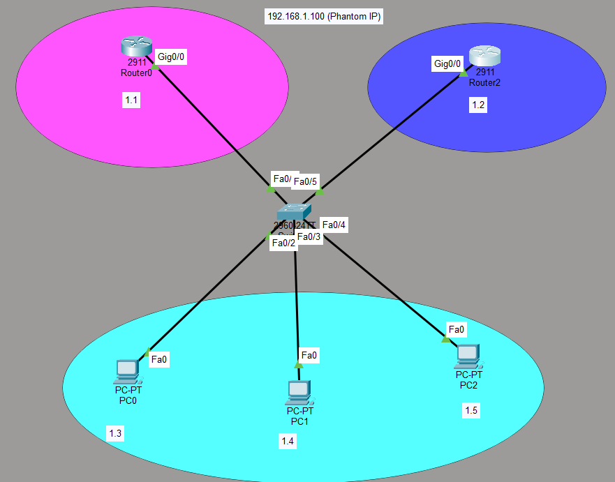

# HSRP Lab: Hot Standby Router Protocol (First Hop Redundancy)

## Objective
Configure HSRP (Hot Standby Router Protocol) to provide gateway redundancy for a LAN. Two routers share a virtual IP address (phantom IP) so that if one router fails, the other takes over automatically, ensuring continuous network connectivity.

## Topology


**Description:**
- **Router0** (2911): Gig0/0 — 192.168.1.1/24 — HSRP priority 200, preempt enabled
- **Router2** (2911): Gig0/0 — 192.168.1.2/24 — HSRP default priority
- **Virtual IP (Phantom IP):** 192.168.1.100 — shared between both routers
- **Switch** (2960-24TT) connects both routers and three PCs
- **PC0, PC1, PC2** on the 192.168.1.0/24 network, using 192.168.1.100 as their default gateway

---

## Devices Used
- **2 Routers** (Cisco 2911)
- **1 Switch** (Cisco 2960-24TT)
- **3 PCs**

---

## IP Addressing

| Device | IP Address | Subnet | Role |
|--------|------------|--------|------|
| Router0 Gig0/0 | 192.168.1.1 | 255.255.255.0 | Active Router (priority 200) |
| Router2 Gig0/0 | 192.168.1.2 | 255.255.255.0 | Standby Router |
| **Virtual IP (HSRP)** | **192.168.1.100** | 255.255.255.0 | **Phantom IP / Default Gateway** |
| PC0 | 192.168.1.x | 255.255.255.0 | Client |
| PC1 | 192.168.1.x | 255.255.255.0 | Client |
| PC2 | 192.168.1.x | 255.255.255.0 | Client |

---

## Key Concepts

| Concept | Explanation |
|---------|-------------|
| **HSRP** | Cisco proprietary protocol that allows two or more routers to share a virtual IP address |
| **Virtual IP (Phantom IP)** | The shared IP address (192.168.1.100) that clients use as their default gateway |
| **Active Router** | The router currently forwarding traffic (Router0 with higher priority) |
| **Standby Router** | The backup router ready to take over if the active router fails (Router2) |
| **Priority** | Determines which router becomes active (higher = more likely to be active) |
| **Preempt** | Allows a router with higher priority to take over as active when it comes online |

---

## Configuration

### Router0 (Active Router — Left)
```
interface GigabitEthernet0/0
ip address 192.168.1.1 255.255.255.0
standby 5 ip 192.168.1.100
standby 5 priority 200
standby 5 preempt
no shutdown
```

### Router2 (Standby Router — Right)
```
interface GigabitEthernet0/0
ip address 192.168.1.2 255.255.255.0
standby 5 ip 192.168.1.100
no shutdown
```

### PC Configuration
| PC | IP Address | Default Gateway |
|----|------------|-----------------|
| PC0 | 192.168.1.x | 192.168.1.100 |
| PC1 | 192.168.1.x | 192.168.1.100 |
| PC2 | 192.168.1.x | 192.168.1.100 |

---

## Verification

### Commands
```
show standby
show standby brief
```

### Expected Output
| Router | State | Priority | Virtual IP |
|--------|-------|----------|------------|
| Router0 | **Active** | 200 | 192.168.1.100 |
| Router2 | **Standby** | 100 (default) | 192.168.1.100 |

### Connectivity Tests
- From PC0, PC1, PC2: `ping 192.168.1.100` → **Succeeds** (virtual IP responds)
- From PC0, PC1, PC2: `ping 192.168.1.1` → **Succeeds** (Router0 physical IP)
- From PC0, PC1, PC2: `ping 192.168.1.2` → **Succeeds** (Router2 physical IP)

### Failover Test
1. Shut down Router0's Gig0/0 interface
2. Router2 should automatically become the **Active** router
3. PCs should still be able to ping 192.168.1.100 with minimal disruption
4. Bring Router0 back up — with `preempt` enabled, it will retake the Active role

---

## What I Learned

- **HSRP provides gateway redundancy** — if the active router fails, the standby router takes over automatically, minimizing downtime.
- **The virtual IP (phantom IP)** is the address that clients use as their default gateway — they don't need to know which physical router is active.
- **Priority determines the active router** — higher priority wins. The default priority is 100.
- **Preempt allows a higher-priority router to reclaim the active role** when it comes back online.
- **HSRP is Cisco proprietary** — for multi-vendor environments, VRRP (Virtual Router Redundancy Protocol) is the standard alternative.
- **Failover is transparent to end users** — they continue using the same gateway IP (192.168.1.100) without any configuration change.

---

## Files Included
| File | Description |
|------|-------------|
| `HSRP.pkt` | Packet Tracer file containing the HSRP lab |
| `Topology1.png` | Topology screenshot |
| `README.md` | This documentation |
