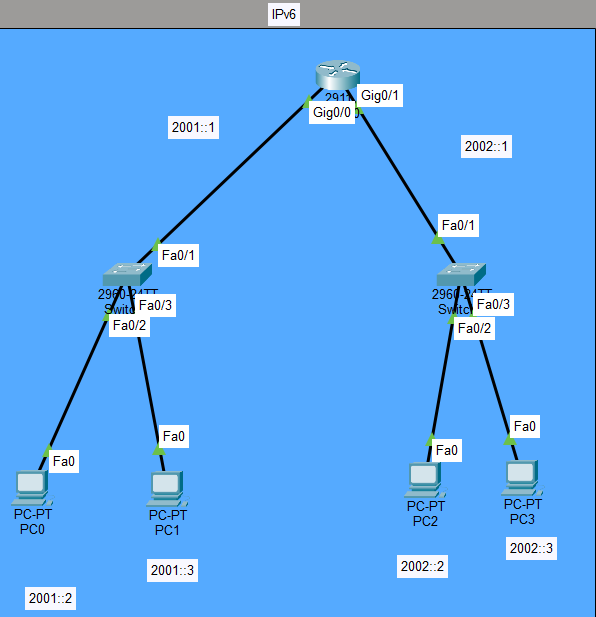
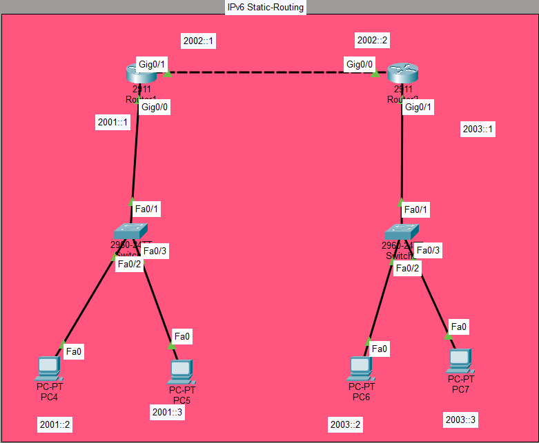
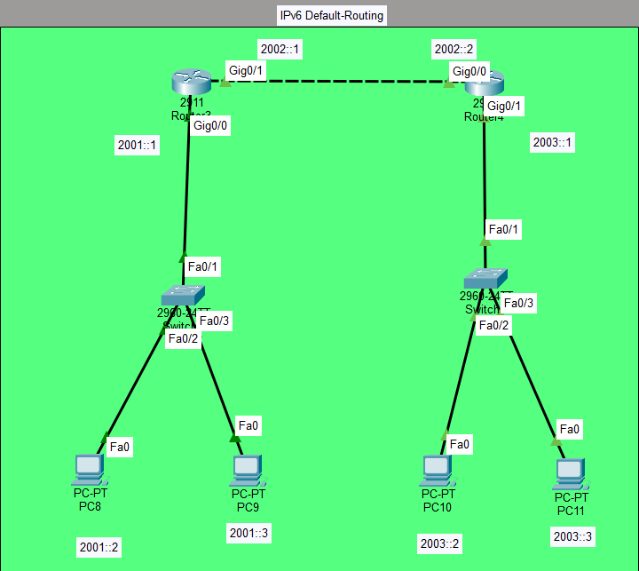
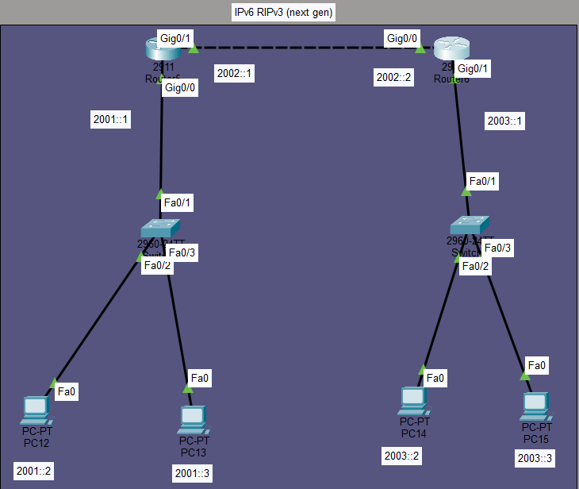

# IPv6 Lab: Addressing, Static Routing, Default Routing, RIPng, and ACL

## Objective
Configure and verify IPv6 in four different scenarios:
1. **IPv6 Addressing** — Basic IPv6 address configuration on routers and PCs
2. **IPv6 Static Routing** — Manual IPv6 routes between two routers
3. **IPv6 Default Routing** — Default route (`::/0`) for edge routers
4. **IPv6 RIPng (RIP Next Generation)** — Dynamic IPv6 routing
5. **IPv6 ACL** — Traffic filtering with IPv6 access lists

## Topologies

### Scenario 1: IPv6 Addressing


**Description:**
- Router (2911) with Gig0/0 (2001::1/64) and Gig0/1 (2002::1/64)
- Switch 1 connects PC0 (2001::2) and PC1 (2001::3)
- Switch 2 connects PC2 (2002::2) and PC3 (2002::3)
- Basic IPv6 addressing only — no routing protocols

### Scenario 2: IPv6 Static Routing


**Description:**
- **Left Router** (2911): Gig0/0 (2001::1/64), Gig0/1 (2002::1/64)
- **Right Router** (2911): Gig0/0 (2002::2/64), Gig0/1 (2003::1/64)
- PC4, PC5 on the 2001::/64 network
- PC6, PC7 on the 2003::/64 network
- Static routes configured on both routers

### Scenario 3: IPv6 Default Routing


**Description:**
- **Left Router** (2911): Gig0/0 (2001::1/64), Gig0/1 (2002::1/64)
- **Right Router** (2911): Gig0/0 (2002::2/64), Gig0/1 (2003::1/64)
- PC8, PC9 on the 2001::/64 network
- PC10, PC11 on the 2003::/64 network
- Default routes (`::/0`) configured on both routers
- IPv6 ACL applied on the left router

### Scenario 4: IPv6 RIPng (RIP Next Generation)


**Description:**
- **Left Router** (2911): Gig0/0 (2001::1/64), Gig0/1 (2002::1/64) — RIPng `ali`
- **Right Router** (2911): Gig0/0 (2002::2/64), Gig0/1 (2003::1/64) — RIPng `ali`
- PC12, PC13 on the 2001::/64 network
- PC14, PC15 on the 2003::/64 network
- RIPng dynamically exchanges routes between routers

---

## Devices Used
- **7 Routers** (Cisco 2911)
- **8 Switches** (Cisco 2960-24TT)
- **16 PCs**

---

## Scenario 1: IPv6 Addressing — Configuration

### IP Addressing
| Device | Interface | IPv6 Address | Prefix |
|--------|-----------|--------------|--------|
| Router | Gig0/0 | 2001::1 | /64 |
| Router | Gig0/1 | 2002::1 | /64 |
| PC0 | Fa0 | 2001::2 | /64 |
| PC1 | Fa0 | 2001::3 | /64 |
| PC2 | Fa0 | 2002::2 | /64 |
| PC3 | Fa0 | 2002::3 | /64 |

### Key Concepts
- IPv6 addressing (128-bit)
- Enabling IPv6 routing globally
- Interface configuration with `ipv6 address`

### Configuration
```
ipv6 unicast-routing
!
interface GigabitEthernet0/0
ipv6 address 2001::1/64
no shutdown
!
interface GigabitEthernet0/1
ipv6 address 2002::1/64
no shutdown
```

### Verification
```
- `show ipv6 interface brief`
- `show ipv6 route`
- From PC0: `ping 2002::2` (after configuring the router)
```

---

## Scenario 2: IPv6 Static Routing — Configuration

### IP Addressing
| Device | Interface | IPv6 Address | Prefix |
|--------|-----------|--------------|--------|
| Left Router | Gig0/0 | 2001::1 | /64 |
| Left Router | Gig0/1 | 2002::1 | /64 |
| Right Router | Gig0/0 | 2002::2 | /64 |
| Right Router | Gig0/1 | 2003::1 | /64 |

### Key Concepts
- IPv6 static routes
- Next-hop IPv6 address
- Bidirectional routing

### Configuration
**Left Router:**
```
ipv6 unicast-routing
!
ipv6 route 2003::/64 2002::2
```

**Right Router:**
```
ipv6 unicast-routing
!
ipv6 route 2001::/64 2002::1
```

### Verification
```
- `show ipv6 route` (static routes marked with `S`)
- `show ipv6 route static`
- From PC4: `ping 2003::2` → **Succeeds**
```
---

## Scenario 3: IPv6 Default Routing + ACL — Configuration

### IP Addressing
| Device | Interface | IPv6 Address | Prefix |
|--------|-----------|--------------|--------|
| Left Router | Gig0/0 | 2001::1 | /64 |
| Left Router | Gig0/1 | 2002::1 | /64 |
| Right Router | Gig0/0 | 2002::2 | /64 |
| Right Router | Gig0/1 | 2003::1 | /64 |

### Key Concepts
- IPv6 default route (`::/0`)
- IPv6 ACL to filter traffic
- Blocking HTTP from a specific host

### Configuration
**Left Router:**
```
ipv6 unicast-routing
!
ipv6 route ::/0 2002::2
!
ipv6 access-list nti
deny tcp host 2001::2 host 2003::3 eq www
permit ipv6 any any
!
interface GigabitEthernet0/0
ipv6 traffic-filter nti in
```

**Right Router:**
```
ipv6 unicast-routing
!
ipv6 route ::/0 2002::1
```

### Verification
```
- `show ipv6 route` (default route marked with `S ::/0`)
- `show ipv6 access-lists`
- From PC8 (2001::2): HTTP to 2003::3 → **Blocked**
- From PC8: `ping 2003::2` → **Succeeds** (ICMP allowed)
- From PC9 (2001::3): HTTP to 2003::3 → **Succeeds**
```
---

## Scenario 4: IPv6 RIPng (RIP Next Generation) — Configuration

### IP Addressing
| Device | Interface | IPv6 Address | Prefix |
|--------|-----------|--------------|--------|
| Left Router | Gig0/0 | 2001::1 | /64 |
| Left Router | Gig0/1 | 2002::1 | /64 |
| Right Router | Gig0/0 | 2002::2 | /64 |
| Right Router | Gig0/1 | 2003::1 | /64 |

### Key Concepts
- RIPng (RIP Next Generation) for IPv6
- Dynamic routing with a process name (`ali`)
- Same process name on both routers to form neighbors

### Configuration
**Left Router:**
```
ipv6 unicast-routing
!
ipv6 router rip ali
!
interface GigabitEthernet0/0
ipv6 address 2001::1/64
ipv6 rip ali enable
no shutdown
!
interface GigabitEthernet0/1
ipv6 address 2002::1/64
ipv6 rip ali enable
no shutdown
```

**Right Router:**
```
ipv6 unicast-routing
!
ipv6 router rip ali
!
interface GigabitEthernet0/0
ipv6 address 2002::2/64
ipv6 rip ali enable
no shutdown
!
interface GigabitEthernet0/1
ipv6 address 2003::1/64
ipv6 rip ali enable
no shutdown
```

### Verification
```
- `show ipv6 rip` — RIPng process status
- `show ipv6 route` — RIPng routes marked with `R`
- `show ipv6 rip next-hops`
- From PC12: `ping 2003::2` → **Succeeds**
```
---

## What I Learned

- **IPv6 routing is disabled by default** — you must enable it with `ipv6 unicast-routing` before configuring any IPv6 routing protocol.
- **IPv6 addresses are 128-bit** and written in hexadecimal with colons (e.g., `2001::1/64`).
- **Static IPv6 routes** use `ipv6 route <destination>/<prefix> <next-hop>`.
- **Default IPv6 route** is `::/0` — it acts as the gateway of last resort.
- **RIPng** uses a process name (not a number like IPv4 RIP). The name must match on both routers to form neighbors.
- **IPv6 ACLs** use `ipv6 access-list` and are applied with `ipv6 traffic-filter` on the interface.
- **`show ipv6 route`** is the key command to verify IPv6 routing tables.
- **`show ipv6 protocols`** confirms IPv6 routing is enabled.

---

## Files Included
| File | Description |
|------|-------------|
| `IPv6.pkt` | Packet Tracer file containing all four scenarios |
| `Topology1.png` | Scenario 1 topology screenshot (IPv6 Addressing) |
| `Topology2.png` | Scenario 2 topology screenshot (IPv6 Static Routing) |
| `Topology3.png` | Scenario 3 topology screenshot (IPv6 Default Routing + ACL) |
| `Topology4.png` | Scenario 4 topology screenshot (IPv6 RIPng) |
| `README.md` | This documentation |