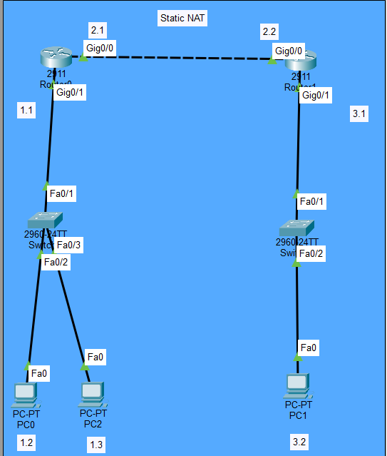
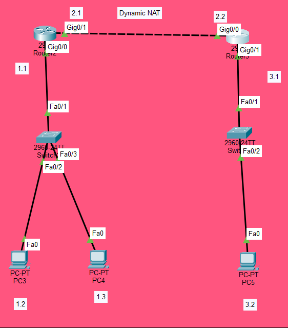

# NAT Lab: Static NAT and Dynamic NAT (Pool-Based)

## Objective
Configure Network Address Translation (NAT) in two different scenarios:
1. **Static NAT** — One-to-one mapping between inside local and inside global addresses
2. **Dynamic NAT with Pool** — Many-to-many mapping using a pool of public IP addresses

## Topologies

### Scenario 1: Static NAT


**Description:**
- **Router0** (2911): Gig0/1 (192.168.1.1) — inside network; Gig0/0 (192.168.2.1) — outside network
- **Router1** (2911): Gig0/0 (192.168.2.2) — outside; Gig0/1 (192.168.3.1) — remote network
- **PC0** (192.168.1.2) and **PC2** (192.168.1.3) on the inside network
- **PC1** (192.168.3.2) on the remote network
- Static NAT maps inside hosts to specific public IP addresses (50.0.0.1 – 50.0.0.3)

### Scenario 2: Dynamic NAT (Pool-Based)


**Description:**
- **Router2** (2911): Gig0/0 (192.168.1.1) — inside network; Gig0/1 (192.168.2.1) — outside network
- **Router3** (2911): Gig0/0 (192.168.2.2) — outside; Gig0/1 (192.168.3.1) — remote network
- **PC3** (192.168.1.2) and **PC4** (192.168.1.3) on the inside network
- **PC5** (192.168.3.2) on the remote network
- Dynamic NAT pool `nti` uses 11.0.0.1 – 11.0.0.30 for translation

---

## Devices Used
- **4 Routers** (Cisco 2911)
- **4 Switches** (Cisco 2960-24TT)
- **5 PCs**

---

## Scenario 1: Static NAT — Configuration

### IP Addressing
| Device | IP Address | Subnet | Role |
|--------|------------|--------|------|
| Router0 Gig0/1 | 192.168.1.1 | 255.255.255.0 | Inside |
| Router0 Gig0/0 | 192.168.2.1 | 255.255.255.0 | Outside |
| Router1 Gig0/0 | 192.168.2.2 | 255.255.255.0 | Outside |
| Router1 Gig0/1 | 192.168.3.1 | 255.255.255.0 | Remote |
| PC0 | 192.168.1.2 | 255.255.255.0 | Inside Local |
| PC2 | 192.168.1.3 | 255.255.255.0 | Inside Local |
| PC1 | 192.168.3.2 | 255.255.255.0 | Remote |

### Static NAT Mappings
| Inside Local | Inside Global |
|--------------|---------------|
| 192.168.1.2 | 50.0.0.1 |
| 192.168.1.2 | 50.0.0.3 |
| 192.168.1.3 | 50.0.0.1 |
| 192.168.1.3 | 50.0.0.2 |

### Router0 (Left — Static NAT) Configuration
```
interface GigabitEthernet0/0
ip address 192.168.2.1 255.255.255.0
ip nat outside
no shutdown
!
interface GigabitEthernet0/1
ip address 192.168.1.1 255.255.255.0
ip nat inside
no shutdown
!
ip nat inside source static 192.168.1.2 50.0.0.1
ip nat inside source static 192.168.1.3 50.0.0.1
ip nat inside source static 192.168.1.3 50.0.0.2
ip nat inside source static 192.168.1.2 50.0.0.3
!
ip route 0.0.0.0 0.0.0.0 192.168.2.2
```

### Router1 (Right — Static NAT) Configuration
```
interface GigabitEthernet0/0
ip address 192.168.2.2 255.255.255.0
no shutdown
!
interface GigabitEthernet0/1
ip address 192.168.3.1 255.255.255.0
no shutdown
!
ip route 0.0.0.0 0.0.0.0 192.168.2.1
```

### Key Concepts
- Static NAT creates a permanent one-to-one mapping
- `ip nat inside` marks the inside interface
- `ip nat outside` marks the outside interface
- Default route is required for traffic to reach remote networks

### Verification
- `show ip nat translations`
- `show ip nat statistics`
- From PC0 (192.168.1.2): `ping 192.168.3.2` → **Succeeds**
- The translation table shows the mapping from 192.168.1.2 to 50.0.0.1

---

## Scenario 2: Dynamic NAT (Pool-Based) — Configuration

### IP Addressing
| Device | IP Address | Subnet | Role |
|--------|------------|--------|------|
| Router2 Gig0/0 | 192.168.1.1 | 255.255.255.0 | Inside |
| Router2 Gig0/1 | 192.168.2.1 | 255.255.255.0 | Outside |
| Router3 Gig0/0 | 192.168.2.2 | 255.255.255.0 | Outside |
| Router3 Gig0/1 | 192.168.3.1 | 255.255.255.0 | Remote |
| PC3 | 192.168.1.2 | 255.255.255.0 | Inside Local |
| PC4 | 192.168.1.3 | 255.255.255.0 | Inside Local |
| PC5 | 192.168.3.2 | 255.255.255.0 | Remote |

### Router2 (Left — Dynamic NAT) Configuration
```
interface GigabitEthernet0/0
ip address 192.168.1.1 255.255.255.0
ip nat inside
no shutdown
!
interface GigabitEthernet0/1
ip address 192.168.2.1 255.255.255.0
ip nat outside
no shutdown
!
ip nat pool nti 11.0.0.1 11.0.0.30 netmask 255.0.0.0
ip nat inside source list 1 pool nti
!
access-list 1 permit 192.168.1.0 0.0.0.255
!
ip route 0.0.0.0 0.0.0.0 192.168.2.2
```

### Router3 (Right — Dynamic NAT) Configuration
```
interface GigabitEthernet0/0
ip address 192.168.2.2 255.255.255.0
no shutdown
!
interface GigabitEthernet0/1
ip address 192.168.3.1 255.255.255.0
no shutdown
!
ip route 0.0.0.0 0.0.0.0 192.168.2.1
```

### Key Concepts
- **Dynamic NAT pool** (`ip nat pool nti`) defines a range of public IP addresses
- **ACL** (`access-list 1`) identifies which inside hosts are allowed to use NAT
- **`ip nat inside source list 1 pool nti`** binds the ACL to the NAT pool
- Addresses are assigned on a first-come, first-served basis

### Verification
- `show ip nat translations`
- `show ip nat statistics`
- From PC3 (192.168.1.2): `ping 192.168.3.2` → **Succeeds**
- The translation table shows the dynamic mapping from inside local to the NAT pool

---

## What I Learned

- **Static NAT** creates permanent one-to-one mappings between inside and outside addresses.
- **Dynamic NAT** uses a pool of public IP addresses and assigns them dynamically to inside hosts.
- **`ip nat inside`** and **`ip nat outside`** must be configured on the correct interfaces.
- **ACLs** are used with dynamic NAT to define which traffic is translated.
- **Default routes** are essential for NAT to work across multiple routers.
- **`show ip nat translations`** is the key verification command to see active translations.
- Static NAT is useful for servers that need a consistent public IP, while dynamic NAT is better for client networks with many hosts sharing a pool of addresses.

---

## Files Included
| File | Description |
|------|-------------|
| `NAT.pkt` | Packet Tracer file containing both scenarios |
| `Topology1.png` | Scenario 1 topology screenshot (Static NAT) |
| `Topology2.png` | Scenario 2 topology screenshot (Dynamic NAT) |
| `README.md` | This documentation |