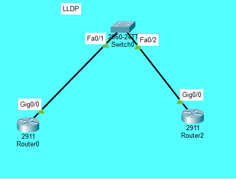
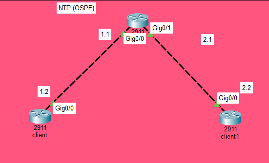
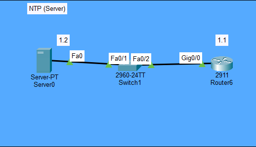

# NTP & LLDP Lab: Network Time Protocol and Link Layer Discovery Protocol

## Objective
Configure and verify:
1. **LLDP (Link Layer Discovery Protocol)** — Neighbor discovery between directly connected devices
2. **NTP (Network Time Protocol)** — Time synchronization across network devices
   - NTP with OSPF (router as NTP master)
   - NTP with authentication (dedicated NTP server)
   - NTP with MD5 authentication

## Topologies

### Scenario 1: LLDP


**Description:**
- **Router0** (2911): Gig0/0 (192.168.1.1) — LLDP enabled
- **Router2** (2911): Gig0/0 (192.168.1.2) — LLDP enabled
- **Switch0** (2960-24TT) — LLDP enabled, connects both routers
- LLDP is used to discover directly connected neighbors

### Scenario 2: NTP (OSPF)


**Description:**
- **Middle Router** (2911): Gig0/0 (192.168.1.1), Gig0/1 (192.168.2.1) — NTP Master
- **Left Router (client)** (2911): Gig0/0 (192.168.1.2) — NTP client
- **Right Router (client1)** (2911): Gig0/0 (192.168.2.2) — NTP client
- OSPF is configured for routing between all routers
- The middle router acts as the NTP master; the others synchronize to it

### Scenario 3: NTP (Server)


**Description:**
- **Server0** (Server-PT): 192.168.1.2 — NTP server with authentication enabled
- **Router6** (2911): Gig0/0 (192.168.1.1) — NTP client with MD5 authentication
- **Switch1** (2960-24TT) connects the server and router
- The router authenticates to the NTP server using MD5 key 1

---

## Devices Used
- **6 Routers** (Cisco 2911)
- **2 Switches** (Cisco 2960-24TT)
- **1 Server** (Server-PT)

---

## Scenario 1: LLDP — Configuration

### IP Addressing
| Device | Interface | IP Address | Subnet |
|--------|-----------|------------|--------|
| Router0 | Gig0/0 | 192.168.1.1 | 255.255.255.0 |
| Router2 | Gig0/0 | 192.168.1.2 | 255.255.255.0 |
| Switch0 | — | — | — |

### Key Concepts
- **LLDP** is a vendor-neutral Layer 2 discovery protocol
- It allows devices to advertise their identity, capabilities, and neighbors
- Enabled globally with `lldp run`

### Configuration
**Router0:**
```
lldp run
!
interface GigabitEthernet0/0
ip address 192.168.1.1 255.255.255.0
no shutdown
```

**Router2:**
```
lldp run
!
interface GigabitEthernet0/0
ip address 192.168.1.2 255.255.255.0
no shutdown
```

**Switch0:**
```
lldp run
```

### Verification
```
show lldp neighbors
show lldp neighbors detail
```

### Expected Output
- Router0 shows Router2 and Switch0 as neighbors
- Router2 shows Router0 and Switch0 as neighbors
- Switch0 shows both routers as neighbors

---

## Scenario 2: NTP with OSPF — Configuration

### IP Addressing
| Device | Interface | IP Address | Subnet | Role |
|--------|-----------|------------|--------|------|
| Middle Router | Gig0/0 | 192.168.1.1 | 255.255.255.0 | NTP Master |
| Middle Router | Gig0/1 | 192.168.2.1 | 255.255.255.0 | NTP Master |
| Left Router | Gig0/0 | 192.168.1.2 | 255.255.255.0 | NTP Client |
| Right Router | Gig0/0 | 192.168.2.2 | 255.255.255.0 | NTP Client |

### Key Concepts
- **NTP Master** — the router acts as the time source
- **NTP Client** — synchronizes its clock to the master
- **OSPF** provides routing between all devices
- `ntp master` configures the router as an NTP master

### Configuration
**Middle Router (NTP Master):**
```
router ospf 1
network 192.168.1.0 0.0.0.255 area 0
network 192.168.2.0 0.0.0.255 area 0
!
ntp master
```

**Left Router (NTP Client):**
```
router ospf 1
network 192.168.1.0 0.0.0.255 area 0
!
ntp server 192.168.1.1
```

**Right Router (NTP Client1):**
```
router ospf 1
network 192.168.2.0 0.0.0.255 area 0
!
ntp server 192.168.2.1
```

### Verification
```
show ntp status
show ntp associations
show clock
```

### Expected Output
- Middle router: `Clock is synchronized, stratum 1`
- Left and Right routers: `Clock is synchronized, stratum 2`
- All routers show the same time (within milliseconds)

---

## Scenario 3: NTP with Authentication (Server) — Configuration

### IP Addressing
| Device | Interface | IP Address | Subnet | Role |
|--------|-----------|------------|--------|------|
| Server0 | Fa0 | 192.168.1.2 | 255.255.255.0 | NTP Server |
| Router6 | Gig0/0 | 192.168.1.1 | 255.255.255.0 | NTP Client |

### Key Concepts
- **NTP Authentication** — MD5 key is used to authenticate the time source
- **NTP Server** — a dedicated server provides time
- **Trusted Key** — the key that the client trusts for authentication

### Server Configuration (Packet Tracer GUI)
| Setting | Value |
|---------|-------|
| Service | NTP |
| Authentication | Enable |
| Key | 1 |
| Password | 1616 |

### Router6 Configuration
```
ntp authentication-key 1 md5 0870181C5F 7
ntp authenticate
ntp trusted-key 1
ntp server 192.168.1.2
ntp update-calendar
```

### Verification
```
show ntp status
show ntp associations
show clock
```

### Expected Output
- Router6: `Clock is synchronized, stratum 2`
- The router synchronizes with the NTP server using MD5 authentication

---

## What I Learned

- **LLDP** is a vendor-neutral protocol for discovering directly connected neighbors. It's useful for network topology mapping and troubleshooting.
- **NTP** is essential for accurate time synchronization across network devices. Accurate time is critical for log correlation, security certificates, and troubleshooting.
- **`ntp master`** configures a router as an NTP time source (stratum 1).
- **`ntp server`** configures a device to synchronize with an NTP server.
- **NTP authentication** (MD5) ensures that time updates come from a trusted source, preventing time-based attacks.
- **OSPF** provides the routing foundation needed for NTP clients to reach the NTP master across subnets.
- **`ntp update-calendar`** updates the hardware calendar with the NTP time.

---

## Files Included
| File | Description |
|------|-------------|
| `NTP-LLDP.pkt` | Packet Tracer file containing all three scenarios |
| `Topology1.png` | Scenario 1 topology screenshot (LLDP) |
| `Topology2.png` | Scenario 2 topology screenshot (NTP with OSPF) |
| `Topology3.png` | Scenario 3 topology screenshot (NTP with Server) |
| `README.md` | This documentation |


