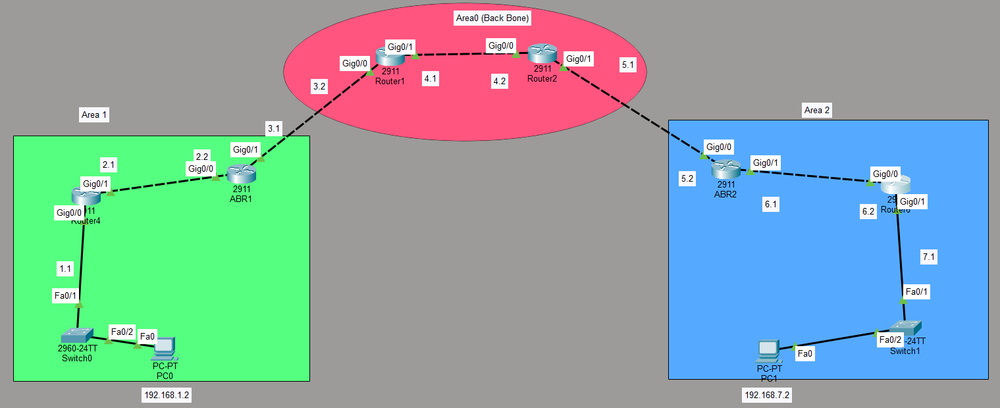

# OSPF Multi-Area Lab: Backbone (Area 0) with Area 1 and Area 2

## Objective
Configure and verify a multi-area OSPF network with a backbone (Area 0) and two additional areas (Area 1 and Area 2). This lab demonstrates how OSPF areas reduce the size of the link-state database and limit the scope of route updates.

## Topology


**Description:**
- **Area 1 (Green)** — Contains Router4 and ABR1
  - Router4: Gig0/0 (192.168.1.1/24), Gig0/1 (192.168.2.1/24)
  - ABR1: Gig0/0 (192.168.2.2/24), Gig0/1 (192.168.3.1/24)
  - PC0 on the 192.168.1.0/24 network
- **Area 0 (Backbone — Red)** — Contains Router1 and Router2
  - Router1: Gig0/0 (192.168.3.2/24), Gig0/1 (192.168.4.1/24)
  - Router2: Gig0/0 (192.168.4.2/24), Gig0/1 (192.168.5.1/24)
- **Area 2 (Blue)** — Contains ABR2 and Router6
  - ABR2: Gig0/0 (192.168.5.2/24), Gig0/1 (192.168.6.1/24)
  - Router6: Gig0/0 (192.168.6.2/24), Gig0/1 (192.168.7.1/24)
  - PC1 on the 192.168.7.0/24 network

---

## Devices Used
- **6 Routers** (Cisco 2911)
- **2 Switches** (Cisco 2960-24TT)
- **2 PCs**

---

## IP Addressing

| Device | Interface | IP Address | Subnet | Area |
|--------|-----------|------------|--------|------|
| Router4 | Gig0/0 | 192.168.1.1 | 255.255.255.0 | Area 1 |
| Router4 | Gig0/1 | 192.168.2.1 | 255.255.255.0 | Area 1 |
| ABR1 | Gig0/0 | 192.168.2.2 | 255.255.255.0 | Area 1 |
| ABR1 | Gig0/1 | 192.168.3.1 | 255.255.255.0 | Area 0 |
| Router1 | Gig0/0 | 192.168.3.2 | 255.255.255.0 | Area 0 |
| Router1 | Gig0/1 | 192.168.4.1 | 255.255.255.0 | Area 0 |
| Router2 | Gig0/0 | 192.168.4.2 | 255.255.255.0 | Area 0 |
| Router2 | Gig0/1 | 192.168.5.1 | 255.255.255.0 | Area 0 |
| ABR2 | Gig0/0 | 192.168.5.2 | 255.255.255.0 | Area 0 |
| ABR2 | Gig0/1 | 192.168.6.1 | 255.255.255.0 | Area 2 |
| Router6 | Gig0/0 | 192.168.6.2 | 255.255.255.0 | Area 2 |
| Router6 | Gig0/1 | 192.168.7.1 | 255.255.255.0 | Area 2 |
| PC0 | Fa0 | 192.168.1.2 | 255.255.255.0 | Area 1 |
| PC1 | Fa0 | 192.168.7.2 | 255.255.255.0 | Area 2 |

---

## Key Concepts

| Concept | Explanation |
|---------|-------------|
| **Multi-Area OSPF** | Divides a large OSPF network into smaller areas to reduce LSA flooding and improve scalability |
| **Backbone (Area 0)** | The core of the OSPF network — all other areas must connect to it |
| **ABR (Area Border Router)** | A router that connects one or more areas to the backbone (Area 0) |
| **Area 1** | A non-backbone area connected to Area 0 via ABR1 |
| **Area 2** | A non-backbone area connected to Area 0 via ABR2 |
| **Passive Interface** | Prevents OSPF from sending hello packets on an interface that has no OSPF neighbors |
| **OSPF Process ID** | Locally significant (can be different on each router) |

---

## Configuration

### Router4 (Area 1 — Internal Router)
```
router ospf 2
passive-interface GigabitEthernet0/0
network 192.168.1.0 0.0.0.255 area 1
network 192.168.2.0 0.0.0.255 area 1
```

### ABR1 (Area 1 / Area 0 — ABR)
```
router ospf 2
network 192.168.2.0 0.0.0.255 area 1
network 192.168.3.0 0.0.0.255 area 0
```

### Router1 (Area 0 — Backbone Router)
```
router ospf 1
network 192.168.3.0 0.0.0.255 area 0
network 192.168.4.0 0.0.0.255 area 0
```

### Router2 (Area 0 — Backbone Router)
```
router ospf 1
network 192.168.4.0 0.0.0.255 area 0
network 192.168.5.0 0.0.0.255 area 0
```

### ABR2 (Area 0 / Area 2 — ABR)
```
router ospf 3
network 192.168.5.0 0.0.0.255 area 0
network 192.168.6.0 0.0.0.255 area 2
```

### Router6 (Area 2 — Internal Router)
```
router ospf 3
passive-interface GigabitEthernet0/1
network 192.168.6.0 0.0.0.255 area 2
network 192.168.7.0 0.0.0.255 area 2
```

---

## Verification

### Commands
```
show ip ospf neighbor
show ip ospf database
show ip route
show ip protocols
```

### Expected Output

**OSPF Neighbors:**
- Router4 ↔ ABR1 (Area 1)
- ABR1 ↔ Router1 (Area 0)
- Router1 ↔ Router2 (Area 0)
- Router2 ↔ ABR2 (Area 0)
- ABR2 ↔ Router6 (Area 2)

**Routing Table:**
- All routers should have routes to all networks (marked with `O` for OSPF, `O IA` for inter-area)
- PC0 (192.168.1.2) can ping PC1 (192.168.7.2)

**Connectivity Tests:**
- From PC0: `ping 192.168.7.2` → **Succeeds**
- From PC1: `ping 192.168.1.2` → **Succeeds**

---

## What I Learned

- **Multi-area OSPF** improves scalability by dividing a large network into smaller areas.
- **Area 0 (backbone)** is the core — all other areas must connect to it.
- **ABRs (Area Border Routers)** connect non-backbone areas to the backbone and perform route summarization.
- **`passive-interface`** prevents OSPF hello packets from being sent on interfaces with no OSPF neighbors (like LAN interfaces).
- **OSPF process IDs** are locally significant — they don't need to match on neighboring routers.
- **`show ip ospf neighbor`** confirms neighbor relationships across areas.
- **`show ip route`** shows OSPF routes — `O` for intra-area and `O IA` for inter-area routes.
- Multi-area OSPF reduces the size of the link-state database and limits the scope of LSA flooding.

---

## Files Included
| File | Description |
|------|-------------|
| `OSPF-multi.pkt` | Packet Tracer file containing the multi-area OSPF lab |
| `Topology1.png` | Topology screenshot |
| `README.md` | This documentation |