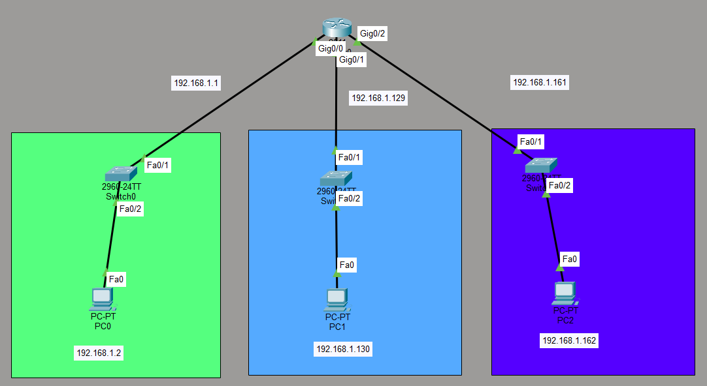
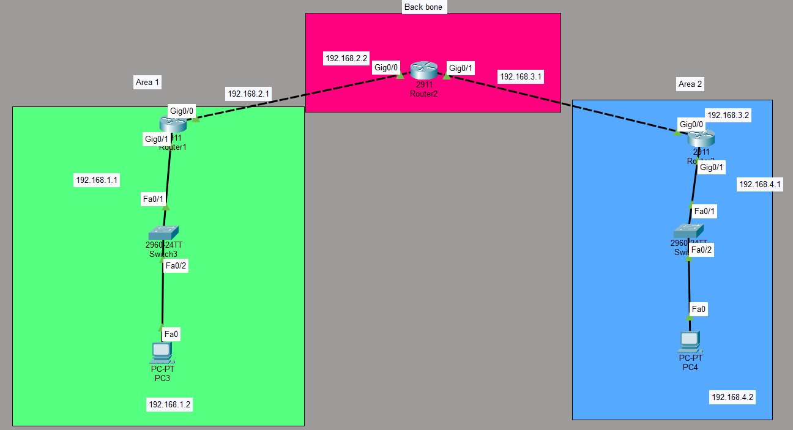

# OSPF Lab: Single-Area and Multi-Area OSPF Configuration

## Objective
Configure and verify OSPF (Open Shortest Path First) in two different scenarios:
1. **Subnetting with OSPF** — Configure a router with three subnets (using VLSM) without a routing protocol
2. **Multi-Area OSPF** — Configure OSPF across a backbone and two areas (Area 1 and Area 2)

## Topologies

### Scenario 1: Subnetting (VLSM) with OSPF


**Description:**
- **Router `sub`** (2911) with three interfaces using VLSM:
  - Gig0/0 — 192.168.1.1/25 (subnet 1)
  - Gig0/1 — 192.168.1.129/27 (subnet 2)
  - Gig0/2 — 192.168.1.161/30 (subnet 3)
- Three switches connect three PCs:
  - PC0 (192.168.1.2) on the 192.168.1.0/25 network
  - PC1 (192.168.1.130) on the 192.168.1.128/27 network
  - PC2 (192.168.1.162) on the 192.168.1.160/30 network

### Scenario 2: Multi-Area OSPF


**Description:**
- **Area1 Router** (2911): Gig0/0 (192.168.2.1/24), Gig0/1 (192.168.1.1/24) — Area 1
- **Backbone Router2** (2911): Gig0/0 (192.168.2.2/24), Gig0/1 (192.168.3.1/24) — Backbone (Area 0)
- **Area2 Router** (2911): Gig0/0 (192.168.3.2/24), Gig0/1 (192.168.4.1/24) — Area 2
- PC3 on the 192.168.1.0/24 network (Area 1)
- PC4 on the 192.168.4.0/24 network (Area 2)
- OSPF configured across all routers with all interfaces in Area 0 (backbone)

---

## Devices Used
- **4 Routers** (Cisco 2911)
- **5 Switches** (Cisco 2960-24TT)
- **5 PCs**

---

## Scenario 1: Subnetting (VLSM) — Configuration

### IP Addressing
| Interface | IP Address | Subnet Mask | Network |
|-----------|------------|-------------|---------|
| Gig0/0 | 192.168.1.1 | 255.255.255.128 (/25) | 192.168.1.0/25 |
| Gig0/1 | 192.168.1.129 | 255.255.255.224 (/27) | 192.168.1.128/27 |
| Gig0/2 | 192.168.1.161 | 255.255.255.252 (/30) | 192.168.1.160/30 |

### Key Concepts
- VLSM (Variable Length Subnet Masking)
- Subnetting a single network (192.168.1.0/24) into smaller subnets
- Different subnet masks on different interfaces
- No routing protocol required (directly connected networks)

### Configuration
```
interface GigabitEthernet0/0
ip address 192.168.1.1 255.255.255.128
no shutdown
!
interface GigabitEthernet0/1
ip address 192.168.1.129 255.255.255.224
no shutdown
!
interface GigabitEthernet0/2
ip address 192.168.1.161 255.255.255.252
no shutdown
```

### Verification
```
- `show ip interface brief`
- `show ip route`
- From PC0: `ping 192.168.1.130` → **Succeeds**
- From PC1: `ping 192.168.1.162` → **Succeeds**
```
### Subnet Breakdown
| Subnet | Network | Range | Usable Hosts |
|--------|---------|-------|--------------|
| 1 | 192.168.1.0/25 | 192.168.1.1 – 192.168.1.126 | 126 |
| 2 | 192.168.1.128/27 | 192.168.1.129 – 192.168.1.158 | 30 |
| 3 | 192.168.1.160/30 | 192.168.1.161 – 192.168.1.162 | 2 |

---

## Scenario 2: Multi-Area OSPF — Configuration

### IP Addressing
| Device | Interface | IP Address | Subnet | Area |
|--------|-----------|------------|--------|------|
| Area1 | Gig0/0 | 192.168.2.1 | 255.255.255.0 | Area 1 |
| Area1 | Gig0/1 | 192.168.1.1 | 255.255.255.0 | Area 1 |
| Backbone | Gig0/0 | 192.168.2.2 | 255.255.255.0 | Area 0 |
| Backbone | Gig0/1 | 192.168.3.1 | 255.255.255.0 | Area 0 |
| Area2 | Gig0/0 | 192.168.3.2 | 255.255.255.0 | Area 2 |
| Area2 | Gig0/1 | 192.168.4.1 | 255.255.255.0 | Area 2 |
| PC3 | Fa0 | 192.168.1.2 | 255.255.255.0 | Area 1 |
| PC4 | Fa0 | 192.168.4.2 | 255.255.255.0 | Area 2 |

### Key Concepts
- Multi-area OSPF
- Backbone area (Area 0)
- OSPF neighbor relationships
- Route advertisement between areas

### Configuration
**Area1 Router:**
```
router ospf 1
network 192.168.1.0 0.0.0.255 area 0
network 192.168.2.0 0.0.0.255 area 0
```

**Backbone Router2:**
```
router ospf 1
network 192.168.2.0 0.0.0.255 area 0
network 192.168.3.0 0.0.0.255 area 0
```

**Area2 Router:**
```
router ospf 1
network 192.168.3.0 0.0.0.255 area 0
network 192.168.4.0 0.0.0.255 area 0
```

### Verification
```
- `show ip ospf neighbor` — shows OSPF neighbors
- `show ip ospf database` — shows the OSPF link-state database
- `show ip route` — OSPF routes marked with `O`
- From PC3: `ping 192.168.4.2` → **Succeeds**
- From PC4: `ping 192.168.1.2` → **Succeeds**
```
---

## What I Learned

- **VLSM (Variable Length Subnet Masking)** allows you to use different subnet masks on different interfaces, optimizing IP address usage.
- **Subnetting** a /24 network into /25, /27, and /30 subnets conserves addresses and reduces broadcast domains.
- **OSPF** is a link-state routing protocol that uses the Dijkstra algorithm to find the shortest path.
- **OSPF areas** reduce the size of the link-state database and limit the scope of route updates.
- **Area 0 (backbone)** is the core of an OSPF network — all other areas must connect to it.
- **`show ip ospf neighbor`** confirms that OSPF neighbors are formed.
- **`show ip route`** shows OSPF-learned routes marked with `O`.
- OSPF automatically discovers neighbors and exchanges routing information.

---

## Files Included
| File | Description |
|------|-------------|
| `OSPF.pkt` | Packet Tracer file containing both scenarios |
| `Topology1.png` | Scenario 1 topology screenshot (Subnetting/VLSM) |
| `Topology2.png` | Scenario 2 topology screenshot (Multi-Area OSPF) |
| `README.md` | This documentation |