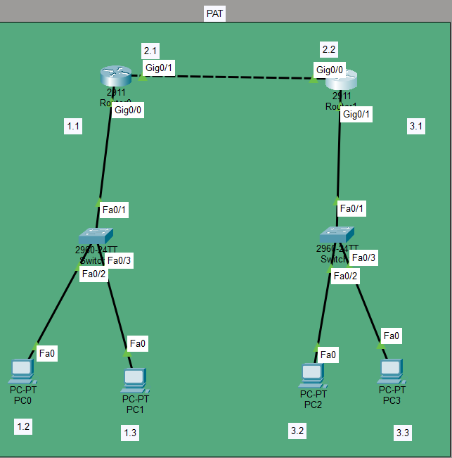

# PAT Lab: Port Address Translation (NAT Overload)

## Objective
Configure PAT (Port Address Translation), also known as NAT Overload, to allow multiple inside hosts to share a single public IP address for outbound traffic.

## Topology


**Description:**
- **Left Router** (2911): Gig0/0 (192.168.1.1/24) — inside network; Gig0/1 (192.168.2.1/24) — outside network
- **Right Router** (2911): Gig0/0 (192.168.2.2/24) — outside; Gig0/1 (192.168.3.1/24) — remote network
- **Switch 1** connects PC0 (192.168.1.2) and PC1 (192.168.1.3) on the inside network
- **Switch 2** connects PC2 (192.168.3.2) and PC3 (192.168.3.3) on the remote network
- PAT translates all inside hosts (192.168.1.0/24) to the outside interface IP (192.168.2.1) using different port numbers

---

## Devices Used
- **2 Routers** (Cisco 2911)
- **2 Switches** (Cisco 2960-24TT)
- **4 PCs**

---

## IP Addressing

| Device | Interface | IP Address | Subnet | Role |
|--------|-----------|------------|--------|------|
| Left Router | Gig0/0 | 192.168.1.1 | 255.255.255.0 | Inside |
| Left Router | Gig0/1 | 192.168.2.1 | 255.255.255.0 | Outside |
| Right Router | Gig0/0 | 192.168.2.2 | 255.255.255.0 | Outside |
| Right Router | Gig0/1 | 192.168.3.1 | 255.255.255.0 | Remote |
| PC0 | Fa0 | 192.168.1.2 | 255.255.255.0 | Inside Local |
| PC1 | Fa0 | 192.168.1.3 | 255.255.255.0 | Inside Local |
| PC2 | Fa0 | 192.168.3.2 | 255.255.255.0 | Remote |
| PC3 | Fa0 | 192.168.3.3 | 255.255.255.0 | Remote |

---

## Key Concepts

| Concept | Explanation |
|---------|-------------|
| **PAT (NAT Overload)** | Multiple inside hosts share a single public IP address using different port numbers |
| **Inside Local** | The private IP address of an inside host (192.168.1.2, 192.168.1.3) |
| **Inside Global** | The public IP address used for translation (192.168.2.1) |
| **ACL** | Defines which inside traffic is translated |
| **Overload** | Enables PAT, allowing many-to-one translation |
| **Port Numbers** | Used to distinguish between different inside hosts sharing the same public IP |

---

## Configuration

### Left Router (PAT Router)
```
interface GigabitEthernet0/0
ip address 192.168.1.1 255.255.255.0
ip nat inside
no shutdown
!
interface GigabitEthernet0/1
ip address 192.168.2.1 255.255.255.0
ip nat outside
no shutdown
!
ip nat inside source list 1 interface GigabitEthernet0/1 overload
!
access-list 1 permit 192.168.1.0 0.0.0.255
!
ip route 0.0.0.0 0.0.0.0 192.168.2.2
ip route 192.168.3.0 255.255.255.0 192.168.2.2
```

### Right Router
```
interface GigabitEthernet0/0
ip address 192.168.2.2 255.255.255.0
no shutdown
!
interface GigabitEthernet0/1
ip address 192.168.3.1 255.255.255.0
no shutdown
!
ip route 192.168.1.0 255.255.255.0 192.168.2.1
```

---

## Verification

### Commands
```
show ip nat translations
show ip nat statistics
show access-lists
show ip route
```

### Expected Output

**After generating traffic (ping from PC0 and PC1 to PC2):**
```
Pro Inside global Inside local Outside local Outside global
icmp 192.168.2.1:1 192.168.1.2:1 192.168.3.2:1 192.168.3.2:1
icmp 192.168.2.1:2 192.168.1.3:1 192.168.3.2:2 192.168.3.2:2
```

Notice:
- **Both inside hosts** use the **same inside global IP** (192.168.2.1)
- They are distinguished by **different port numbers** (1, 2)
- This is the essence of PAT — many-to-one translation

### Statistics
```
Total active translations: 2 (0 static, 2 dynamic; 2 extended)
Outside interfaces:
GigabitEthernet0/1
Inside interfaces:
GigabitEthernet0/0
Hits: 10 Misses: 0
```

---

## What I Learned

- **PAT allows multiple inside hosts to share a single public IP address** — this is the most common form of NAT used in home and enterprise networks.
- **Port numbers** are used to distinguish between different inside hosts sharing the same public IP.
- **`overload`** keyword at the end of the NAT command enables PAT.
- **ACLs** define which inside traffic is eligible for translation.
- **`ip nat inside`** and **`ip nat outside`** must be configured on the correct interfaces — without them, NAT won't work.
- **`show ip nat translations`** shows the active translation table, including port numbers.
- **`show ip nat statistics`** shows hits, misses, and interface information. It only populates after traffic flows.
- PAT is essential because IPv4 addresses are limited, and most organizations have more internal devices than public IP addresses.

---

## Files Included
| File | Description |
|------|-------------|
| `PAT.pkt` | Packet Tracer file containing the PAT lab |
| `Topology1.png` | Topology screenshot |
| `README.md` | This documentation |
