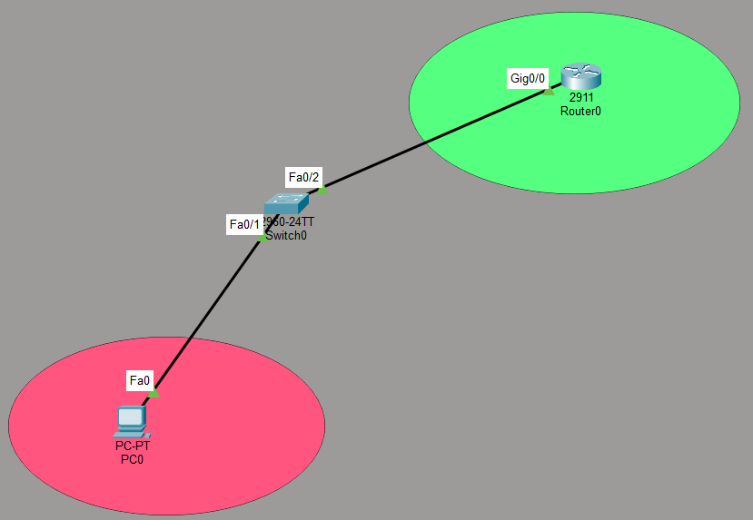

# SSH Lab: Secure Remote Management with SSH

## Objective
Configure a Cisco router to allow secure remote management via SSH (Secure Shell) instead of Telnet. This lab demonstrates how to configure SSH, create local user accounts, and restrict remote access to SSH only.

## Topology


**Description:**
- **Router0 (MO)** (2911): Gig0/0 (192.168.1.1/24)
- **Switch0** (2960-24TT) connects the router and PC0
- **PC0** (192.168.1.2/24) is used to remotely access the router via SSH
- The router is configured with:
  - Hostname `MO`
  - Domain name `NTI.com`
  - Three local users: `Shikabala`, `Sultan`, `Mohamed`
  - SSH version 1
  - VTY lines configured for SSH only (`transport input ssh`)

---

## Devices Used
- **1 Router** (Cisco 2911)
- **1 Switch** (Cisco 2960-24TT)
- **1 PC**

---

## IP Addressing

| Device | Interface | IP Address | Subnet |
|--------|-----------|------------|--------|
| Router0 (MO) | Gig0/0 | 192.168.1.1 | 255.255.255.0 |
| PC0 | Fa0 | 192.168.1.2 | 255.255.255.0 |

---

## Key Concepts

| Concept | Explanation |
|---------|-------------|
| **SSH (Secure Shell)** | A cryptographic protocol for secure remote access, replacing Telnet |
| **Telnet** | Legacy remote access protocol — sends data in plaintext (insecure) |
| **SSH Version 1 vs 2** | Version 2 is more secure; Version 1 is used here for compatibility |
| **Local User Database** | Usernames and passwords stored locally on the router |
| **VTY Lines** | Virtual terminal lines used for remote access |
| **`transport input ssh`** | Restricts remote access to SSH only (disables Telnet) |
| **`login local`** | Uses the local username/password database for authentication |
| **Domain Name** | Required for generating RSA crypto keys |

---

## Configuration

### Step 1: Basic Router Configuration
```
hostname MO
enable secret <password>
!
interface GigabitEthernet0/0
ip address 192.168.1.1 255.255.255.0
no shutdown
```

### Step 2: Configure Domain Name and SSH
```
p domain-name NTI.com
!
ip ssh version 1
```

### Step 3: Create Local Users
```
username Shikabala secret <password>
username Sultan secret <password>
username Mohamed secret <password>
```

### Step 4: Generate RSA Crypto Keys
```
crypto key generate rsa
```

### Step 5: Configure VTY Lines for SSH
```
line vty 0 4
login local
transport input ssh
```


---

## Verification

### Commands
```
show ip ssh
show ssh
show users
show running-config | include username
show running-config | include transport
```

### Expected Output

**`show ip ssh`:**
Connection Version Mode Encryption Hmac State Username
0 1.99 IN aes128-cbc hmac-sha1 Session started Shikabala


### Connectivity Test

From PC0:
1. Open **Command Prompt**
2. Type:ssh -l Shikabala 192.168.1.1

3. Enter the password for user `Shikabala`
4. You should be logged into the router via SSH

> ⚠️ **Note:** In Packet Tracer, SSH may require the PC to have the SSH client available. If not, you can use the router's CLI to test SSH from another router.

---

## What I Learned

- **SSH is more secure than Telnet** — it encrypts all traffic, including passwords, while Telnet sends everything in plaintext.
- **`ip domain-name` is required** before generating RSA crypto keys.
- **`crypto key generate rsa`** generates the encryption keys used for SSH.
- **`ip ssh version 1`** sets the SSH version (version 2 is more secure and recommended in production).
- **`username <name> secret <password>`** creates local user accounts with encrypted passwords.
- **`login local`** tells the router to use the local user database for authentication.
- **`transport input ssh`** restricts VTY access to SSH only, disabling Telnet.
- **`show ip ssh`** verifies that SSH is enabled and shows the version.
- **`show ssh`** shows active SSH sessions.

---

## Security Best Practices

| Practice | Why It Matters |
|----------|----------------|
| Use SSH version 2 | Version 1 has known vulnerabilities |
| Use strong passwords | Prevents brute-force attacks |
| Limit VTY lines | Reduces attack surface |
| Use `transport input ssh` | Disables insecure Telnet |
| Use `login local` | Ensures only authorized users can access |
| Set an enable secret | Protects privileged EXEC mode |
| Configure an ACL on VTY lines | Restricts SSH access to specific IP addresses |

---

## Files Included
| File | Description |
|------|-------------|
| `SSH.pkt` | Packet Tracer file containing the SSH lab |
| `Topology1.png` | Topology screenshot |
| `README.md` | This documentation |

