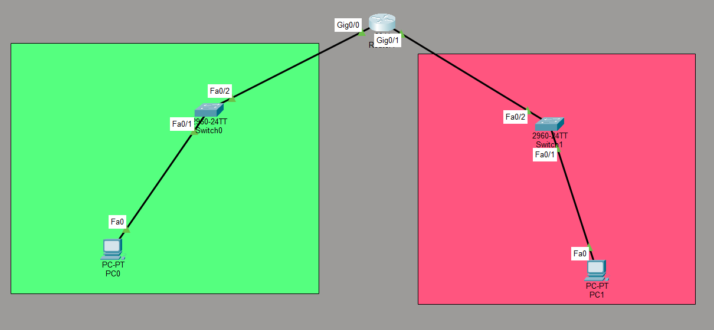

# Telnet Lab: Remote Management with Telnet

## Objective
Configure a Cisco router to allow remote management via Telnet. This lab demonstrates how to configure a VTY password, enable Telnet access, and verify remote connectivity from a PC. It also highlights the security risks of using Telnet compared to SSH.

## Topology


**Description:**
- **Router (MO)** (2911): Gig0/0 (192.168.1.1/24) — left network; Gig0/1 (192.168.2.1/24) — right network
- **Switch0** (2960-24TT) connects the router to PC0 on the left network
- **Switch1** (2960-24TT) connects the router to PC1 on the right network
- **PC0** (192.168.1.2/24) — left network
- **PC1** (192.168.2.2/24) — right network
- The router is configured with:
  - Hostname `MO`
  - Enable secret password
  - VTY password (`246`) for Telnet access
  - `login` (uses the VTY password for authentication)

---

## Devices Used
- **1 Router** (Cisco 2911)
- **2 Switches** (Cisco 2960-24TT)
- **2 PCs**

---

## IP Addressing

| Device | Interface | IP Address | Subnet |
|--------|-----------|------------|--------|
| Router (MO) | Gig0/0 | 192.168.1.1 | 255.255.255.0 |
| Router (MO) | Gig0/1 | 192.168.2.1 | 255.255.255.0 |
| PC0 | Fa0 | 192.168.1.2 | 255.255.255.0 |
| PC1 | Fa0 | 192.168.2.2 | 255.255.255.0 |

---

## Key Concepts

| Concept | Explanation |
|---------|-------------|
| **Telnet** | A legacy remote access protocol that sends data in plaintext |
| **SSH** | A secure alternative to Telnet that encrypts all traffic |
| **VTY Lines** | Virtual terminal lines used for remote access (Telnet/SSH) |
| **`password <password>`** | Sets the password for VTY access |
| **`login`** | Tells the router to prompt for the VTY password |
| **`enable secret`** | Protects privileged EXEC mode |
| **Plaintext** | Telnet sends everything (including passwords) unencrypted |

---

## Configuration

### Step 1: Basic Router Configuration
```
hostname MO
enable secret <password>
!
interface GigabitEthernet0/0
ip address 192.168.1.1 255.255.255.0
no shutdown
!
interface GigabitEthernet0/1
ip address 192.168.2.1 255.255.255.0
no shutdown
```

### Step 2: Configure VTY Lines for Telnet
```
line vty 0 4
password 246
login
```

### Step 3: (Optional) Set Console Password
```
line con 0
password <password>
login
```

---

## Verification

### Commands
```
show running-config | section line vty
show users
```

### Expected Output

**`show running-config | section line vty`:**
```
line vty 0 4
password 246
login
```

**`show users`:**
```
Line User Host(s) Idle Location
0 con 0 idle 00:00:00

    1 vty 0 idle 00:00:00
```

### Connectivity Test

From PC0:
1. Open **Command Prompt**
2. Type:telnet 192.168.1.1

3. Enter the password: `246`
4. You should be logged into the router via Telnet

> ⚠️ **Note:** In Packet Tracer, you must first enable the Telnet client on the PC. Go to **Desktop** → **Command Prompt** and type `telnet 192.168.1.1`. If Telnet is not available, you can use the router's CLI to test Telnet from another router.

---

## What I Learned

- **Telnet is a legacy protocol** — it sends all data (including passwords) in **plaintext**, making it vulnerable to eavesdropping.
- **`line vty 0 4`** configures the virtual terminal lines used for remote access.
- **`password <password>`** sets the password for Telnet access.
- **`login`** tells the router to prompt for the VTY password.
- **`enable secret`** is required to enter privileged EXEC mode.
- **Telnet is not secure** — it should be replaced with SSH in any production environment.
- **`show users`** displays active remote sessions.
- **`show running-config | section line vty`** shows the VTY configuration.

---

## Security Considerations

| Risk | Mitigation |
|------|------------|
| **Plaintext transmission** | Use SSH instead of Telnet |
| **Weak passwords** | Use strong, complex passwords |
| **Unrestricted access** | Apply ACLs to VTY lines to limit source IPs |
| **No encryption** | Use `transport input ssh` to disable Telnet |
| **Brute-force attacks** | Use `login block-for` to limit failed attempts |

### Best Practice: Replace Telnet with SSH
```
ip domain-name example.com
crypto key generate rsa
ip ssh version 2
!
line vty 0 4
login local
transport input ssh
```

---

## Comparison: Telnet vs. SSH

| Feature | Telnet | SSH |
|---------|--------|-----|
| **Encryption** | ❌ None | ✅ Yes |
| **Authentication** | Password only | Password + key-based |
| **Security** | Low | High |
| **Port** | TCP 23 | TCP 22 |
| **Recommendation** | Avoid | Use always |

---

## Files Included
| File | Description |
|------|-------------|
| `Telnet.pkt` | Packet Tracer file containing the Telnet lab |
| `Topology1.png` | Topology screenshot |
| `README.md` | This documentation |
