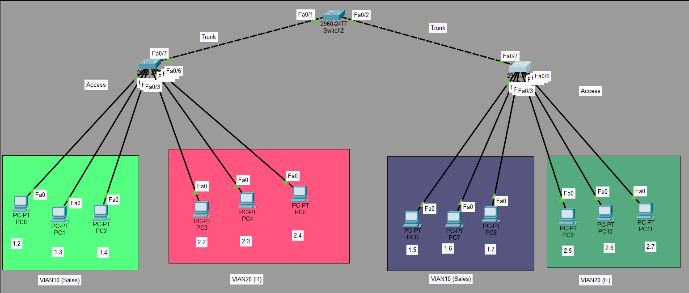

# VLAN Lab: VLAN Configuration with Trunking

## Objective
Configure VLANs (Virtual Local Area Networks) to segment a network into logical groups, and configure trunk links between switches to carry traffic for multiple VLANs.

## Topology


**Description:**
- **Left Switch** (2960-24TT) — access ports for VLAN 10 (Sales) and VLAN 20 (IT)
  - Fa0/1, Fa0/2, Fa0/3 → VLAN 10 (PC0, PC1, PC2)
  - Fa0/4, Fa0/5, Fa0/6 → VLAN 20 (PC3, PC4, PC5)
  - Fa0/7 → Trunk to Middle Switch
- **Middle Switch** (2960-24TT) — trunk links between left and right switches
  - Fa0/1 → Trunk to Left Switch
  - Fa0/2 → Trunk to Right Switch
- **Right Switch** (2960-24TT) — access ports for VLAN 10 (Sales) and VLAN 20 (IT)
  - Fa0/1, Fa0/2, Fa0/3 → VLAN 10 (PC6, PC7, PC8)
  - Fa0/4, Fa0/5, Fa0/6 → VLAN 20 (PC9, PC10, PC11)
  - Fa0/7 → Trunk to Middle Switch

---

## Devices Used
- **3 Switches** (Cisco 2960-24TT)
- **12 PCs**

---

## VLAN Assignment

| VLAN ID | Name | PCs | Switch Ports |
|---------|------|-----|--------------|
| **10** | Sales | PC0, PC1, PC2, PC6, PC7, PC8 | Fa0/1–Fa0/3 (left), Fa0/1–Fa0/3 (right) |
| **20** | IT | PC3, PC4, PC5, PC9, PC10, PC11 | Fa0/4–Fa0/6 (left), Fa0/4–Fa0/6 (right) |

---

## Key Concepts

| Concept | Explanation |
|---------|-------------|
| **VLAN** | A logical segmentation of a physical network into separate broadcast domains |
| **Access Port** | A switch port that belongs to a single VLAN (connects to end devices) |
| **Trunk Port** | A switch port that carries traffic for multiple VLANs (connects to other switches) |
| **802.1Q** | The standard for VLAN tagging on trunk links |
| **VLAN 10 (Sales)** | Contains PC0–PC2 and PC6–PC8 |
| **VLAN 20 (IT)** | Contains PC3–PC5 and PC9–PC11 |
| **Broadcast Domain** | Each VLAN is a separate broadcast domain |

---

## Configuration

### Left Switch
```
! Create VLANs
vlan 10
name Sales
vlan 20
name IT
!
! Assign access ports
interface range FastEthernet0/1-3
switchport mode access
switchport access vlan 10
!
interface range FastEthernet0/4-6
switchport mode access
switchport access vlan 20
!
! Configure trunk port
interface FastEthernet0/7
switchport mode trunk
```

### Middle Switch
```
! Configure trunk ports
interface FastEthernet0/1
switchport mode trunk
!
interface FastEthernet0/2
switchport mode trunk
```

### Right Switch
```
! Create VLANs
vlan 10
name Sales
vlan 20
name IT
!
! Assign access ports
interface range FastEthernet0/1-3
switchport mode access
switchport access vlan 10
!
interface range FastEthernet0/4-6
switchport mode access
switchport access vlan 20
!
! Configure trunk port
interface FastEthernet0/7
switchport mode trunk
```

---

## Verification

### Commands
```
show vlan brief
show interfaces trunk
show interfaces switchport
```

### Expected Output

**`show vlan brief`:**
```
VLAN Name Status Ports

1 default active Fa0/8, Fa0/9, Fa0/10, ...
10 Sales active Fa0/1, Fa0/2, Fa0/3
20 IT active Fa0/4, Fa0/5, Fa0/6
```

**`show interfaces trunk`:**
```
Port Mode Encapsulation Status Native vlan
Fa0/7 on 802.1q trunking 1
```

### Connectivity Tests

| From | To | Expected |
|------|-----|----------|
| PC0 (VLAN 10) | PC1 (VLAN 10) | ✅ Ping succeeds |
| PC0 (VLAN 10) | PC3 (VLAN 20) | ❌ Ping fails (different VLANs) |
| PC0 (VLAN 10) | PC6 (VLAN 10) | ✅ Ping succeeds (same VLAN, across trunk) |
| PC3 (VLAN 20) | PC9 (VLAN 20) | ✅ Ping succeeds (same VLAN, across trunk) |

> **Note:** Inter-VLAN routing requires a Layer 3 device (router or Layer 3 switch). This lab focuses on Layer 2 VLAN segmentation only.

---

## What I Learned

- **VLANs segment a network** into separate broadcast domains, improving performance and security.
- **Access ports** belong to a single VLAN and connect to end devices.
- **Trunk ports** carry traffic for multiple VLANs between switches.
- **802.1Q** is the standard for VLAN tagging on trunk links.
- **`switchport mode access`** configures a port as an access port.
- **`switchport access vlan <id>`** assigns the port to a specific VLAN.
- **`switchport mode trunk`** configures a port as a trunk.
- **`show vlan brief`** displays VLAN assignments.
- **`show interfaces trunk`** displays trunk port information.
- **Devices in the same VLAN can communicate** even across multiple switches (via trunk links).
- **Devices in different VLANs cannot communicate** without a Layer 3 device (router).

---

## Files Included
| File | Description |
|------|-------------|
| `VLAN.pkt` | Packet Tracer file containing the VLAN lab |
| `Topology1.png` | Topology screenshot |
| `README.md` | This documentation |